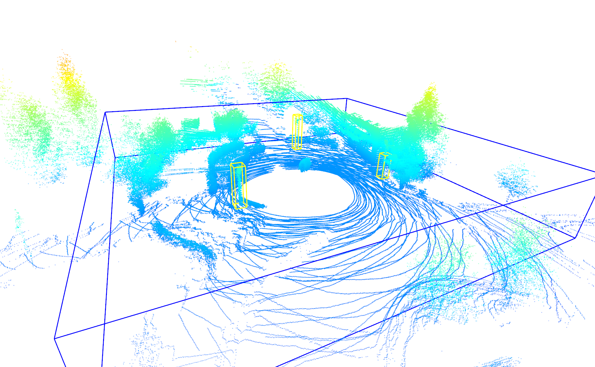
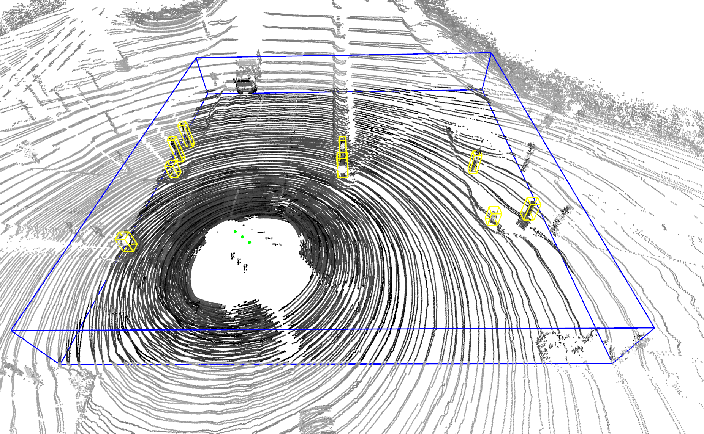
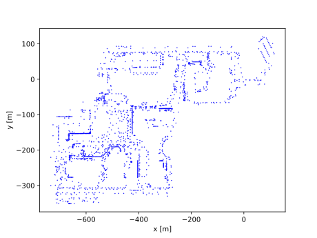
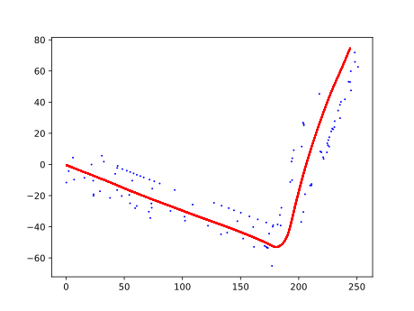
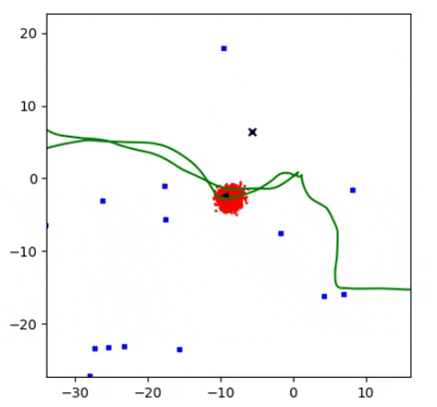
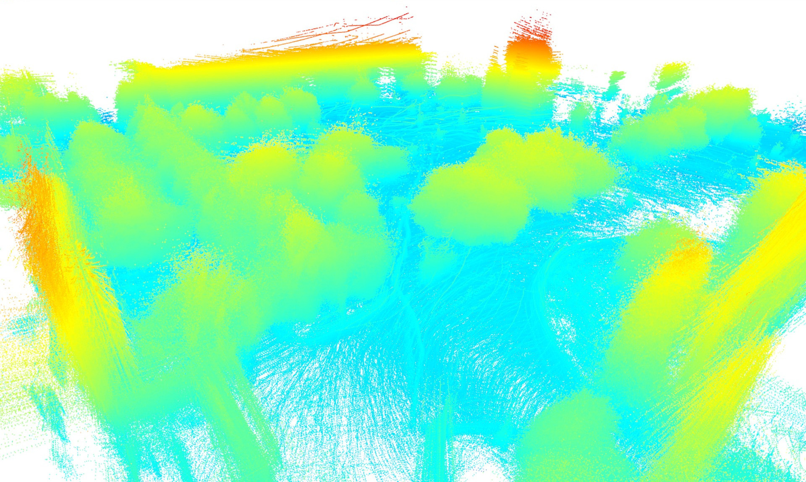
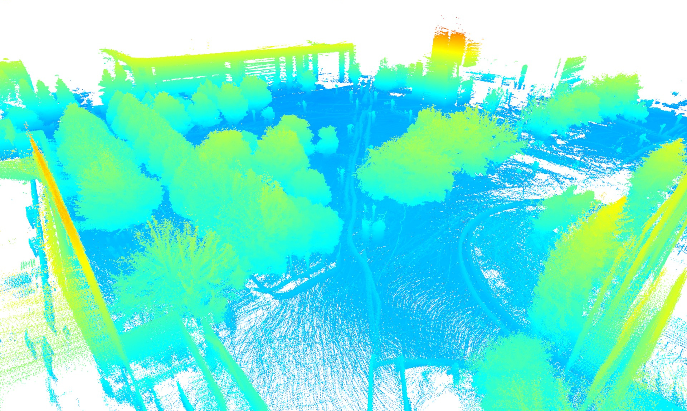

# Long-Term Urban Vehicle Localization Using Pole Landmarks Extracted from 3-D Lidar Scans

> **NOTE**
> 
> In its current version, this repository is a preview.
> We will publish the complete implementation of the localization system described in the paper "Long-Term Urban Vehicle Localization Using Pole Landmarks Extracted from 3-D Lidar Scans" if the paper is accepted.


This repository contains the Python code that accompanies our paper ["Long-Term Urban Vehicle Localization Using Pole Landmarks Extracted from 3-D Lidar Scans"](https://www.ecmr2019.eu/) submitted to the [European Conference on Mobile Robots](https://www.ecmr2019.eu/).
The implementation allows to

* extract the parameters of pole-like objects from 3-D lidar scans,
* create a global reference map of pole landmarks,
* localize a vehicle online based on the reference map and live lidar measurements,
* replicate the experiments on the [NCLT dataset](http://robots.engin.umich.edu/nclt/) and on the [KITTI dataset](http://www.cvlibs.net/datasets/kitti/) described in the paper.

It provides the following three software modules.

### [Pole extractor](poles/poles.py)

This module takes odometry and 3-D lidar scans accumulated over a short trajectory segment as input, searches for pole-like objects in the data, and outputs the parameters of the corresponding pole estimates.


<br/>*Pole extraction from NCLT lidar data.*


<br/>*Pole extraction from KITTI lidar data.*

### Mapping module

Given a set of possibly overlapping local landmark maps generated by the pole extractor, this module resolves all ambiguities and creates a global reference map of pole landmarks.


<br/>*NCLT landmark map.*


<br/>*KITTI landmark map with vehicle trajectory.*

### Localization module

On the basis of the global map, live odometry measurements, and pole landmark estimates, this module computes an estimate of the current vehicle pose using a particle filter.


<br/>*Particle filter localization on NCLT.
The red dots denote the particles, the blue dots denote the reference landmarks, ad the black crosses visualize the online landmarks.*

## Running the code

While the pole extractor is represented by its own Python module [poles.py](poles/poles.py), the mapping and localization module are implemented separately for NCLT [(ncltpoles.py)](poles/ncltpoles.py) and KITTI [(kittipoles.py)](poles/kittipoles.py) due to the different representations of the datasets.
For closer information about the workings of the implementation, please read the paper and follow the source code documentation.

In order to run the scripts with the experiments on NCLT [(ncltpoles.py)](poles/ncltpoles.py) and KITTI [(kittipoles.py)](poles/kittipoles.py), please install the package manager `pip` via

```bash
sudo apt install python-pip python-tk
```

and use it to install the following Python packages:

```bash
pip install numpy matplotlib open3d-python progressbar pyquaternion transforms3d scipy networkx psutil
```

## NCLT ground-truth optimization

For the experiments on NCLT described in the paper, we rely on the ground-truth poses given the by authors.
Due to the way they were created, these poses are however quite noisy.
To deal with this issue, an optimized ground-truth for NCLT can be generated separately for the trajectory of each session using ICP matching of the Velodyne scans.
First a pose graph is created with

```bash
python ncltgtopt.py 2012-01-08
```

The pose graph consists of one node for each odometry measurement (interpolated to the Velodyne time stamps) and corresponding edges.
The original NCLT ground truth poses and covariances are added as edges from an additional origin node at `(0,0,0)`.
Further, ICP scan matching edges are added for each node to its neighbors.

The pose graph is split into chunks and is optimized and merged with:

```bash
python spltoptpg.py 2012-01-08
```

Example images of point clouds registered with the original NCLT ground truth and with our optimized ground truth make the considerable noise in the original ground-truth data obvious:

<br/>*NCLT laser scans accumulated using original ground truth.*


<br/>*NCLT laser scans accumulated using refined ground truth.*
